# 개발 문서.

## 사용법

`Wemos D1 mini` 보드는 UART 통신과 WiFi 통신을 모두 지원하므로 Test 환경에 따라서 통신 방법을 선택할 수 있다.

### COM 포트를 이용하는 방법.

Hardware(Wemos D1 mini)를 PC와 USB 케이블로 연결한다.

USB Driver(`CH340`)는 미리 설치되어 있어야 한다.

[GitHub 사이트](https://github.com/kwangho9/AZ1000) 에서 압축된 파일을 다운로드 받는다.

압축 파일(`AZ1000-master.zip`)을 압축 해제하고, `GUI/node.js/build/app._zip` 파일의 확정자를 `zip`으로 변경하고, 다시 압축 해제한다.

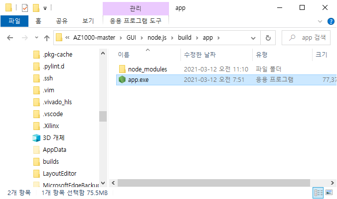

`app.exe` 파일을 더블 클릭해서 실행한다.

아래 그림과 같이 네트워크 보안 창이 생성된다.

네크워크 보안은 `액세스 허용`을 선택해야 한다.

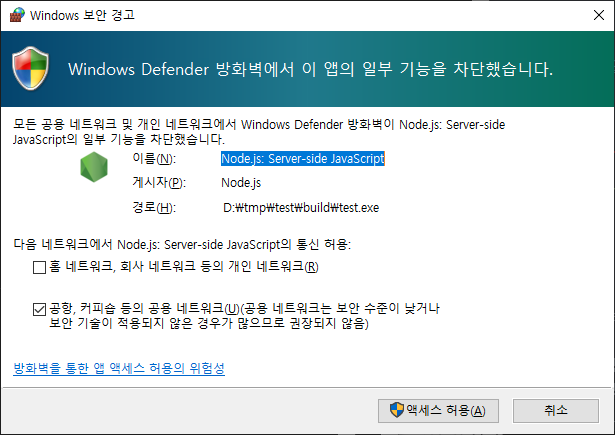

Dos Command 창(`Cmd.exe`)이 실행되면서 브라우저(크롬)이 실행되면서 `Test Application`이 실행된다.

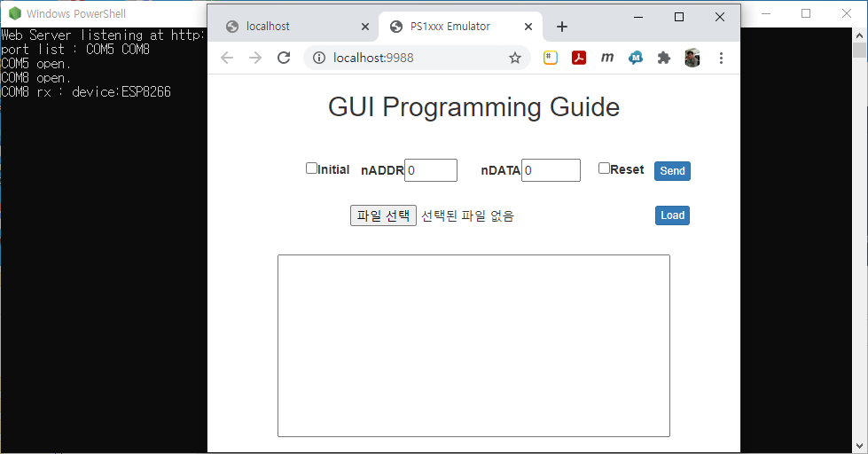

Dos Command 창의 출력된 Log는 PC의 COM 포트를 검색하여 연결된 결과를 보여준다.

크롬 브라우저의 `GUI Programming Guide`(간단히 `GUI`로 기술함.)를 통해서 `EN_VO3(GPIO4)` 신호와 `CTRL(GPIO5)` 신호를 생성할 수 있다.

#### Initial Signal 생성.

`GUI`에서 `Initial` Checkbox를 선택하고, `Send` 버튼을 클릭한다.

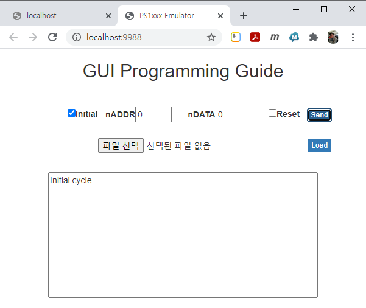

PC의 COM 포트를 통해서 MCU로 전달되고, MCU에서는 아래와 같이 Initial Time을 발생 시킨다.

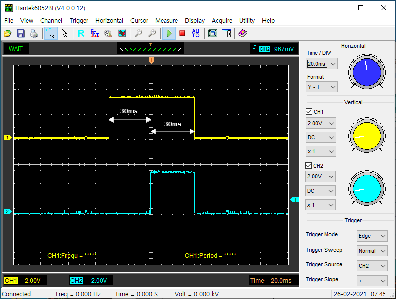

`EN_VO3` 신호는 60ms의 High Pulse를 생성하고, `CTRL` 신호는 `EN_VO3` 신호의 중간에서 30ms 동안 High Pulse를 생성한다.

#### Reset Signal 생성.

`GUI`에서 `Reset` checkbox를 선택하고, `Send` 버튼을 클릭한다.

PC의 COM 포트를 통해서 MCU로 전달되고, MCU에서는 아래와 같이 Reset Time을 발생 시킨다.

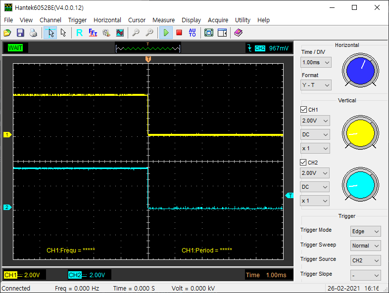

`EN_VO3`와 `CTRL` 신호를 동시에 Low로 설정한다.

#### Data Clock(Packet-1) 생성.

`GUI`에서 `nDATA` 입력에 `1 ~ 64`사이의 값을 입력하고, `Send` 버튼을 클릭한다.

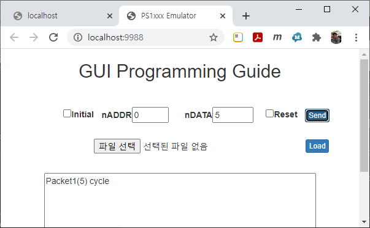

MCU에서는 아래와 같이 `5-clock`의 Signal이 생성된다.

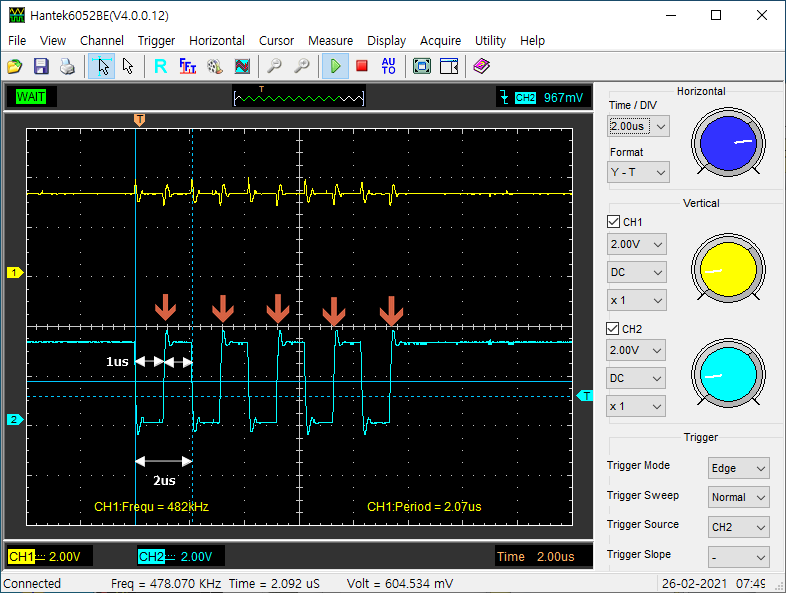

각 clock의 Low/High width는 1us를 유지한다.

#### Addr & Data Clock(Packet-2) 생성.

`GUI`에서 `nDATA` 입력에 `1 ~ 64`사이의 값을 입력하고, `nADDR` 입력에 `1 ~ 8` 사이의 값을 입력한 후에 `Send` 버튼을 클릭한다.

MCU에서는 아래와 같이 `Packet-2`의 Signal이 생성된다.

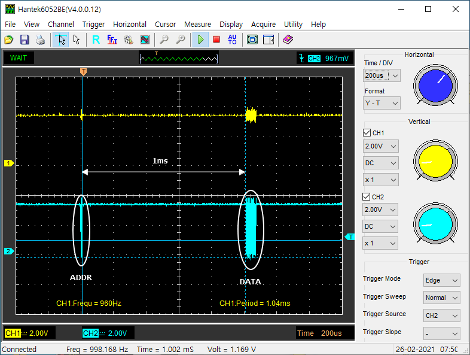

`Addr` 개수만큼의 clock을 생성하고 `1ms` 이후에 `Data` 개수만큼의 clock을 생성한다.

[[TIP]]
`GUI`에서 `nData`가 "0"이면, `nAddr`의 설정된 값은 무시되어 Clock이 생성되지 않는다. 즉, `nAddr`에 설정된 값이 적용되기 위해서는 `nData`에도 값이 설정되어야만 한다.
[[/TIP]]

#### Timimg 조합하기.

`Initial` checkbox를 선택하고, `nADDR`과 `nDATA`에 clock 개수를 입력하고, `Reset` checkbox를 선택한 후에 `Send` 버튼을 클릭해 보자.

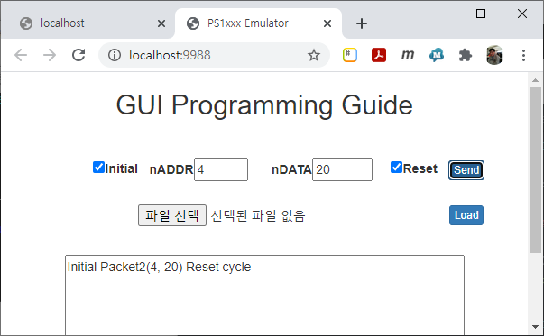

MCU에서는 아래와 같이 `Initial`, `Packet-1`, `Packet-2`와 `Reset` timing을 모두 실행한다.

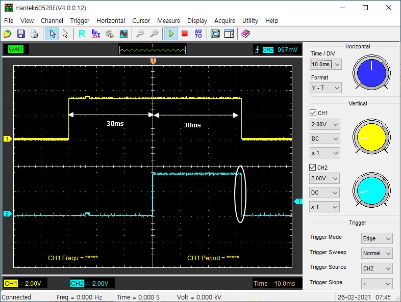

뒷 부분의 `Packet-1`과 `Packet-2` Signal은 너무 빠르기 때문에 보여지지 않았다.

### WiFi 무선 통신을 이용하는 방법.

보드(`Wemos D1 mini`)를 PC와 USB 케이블로 연결한다.

무선(WiFi) 통신을 사용하기 위해서는 PC에서도 WiFi가 가능해야 한다.(즉, WiFi 동글이 설치되어 있거나, Notebook을 사용해야 한다.)

USB Driver는 설치되어 있지 않아도 동작에는 문제가 없다.

PC(Notebook)의 WiFi 설정에서 공유기(AP)를 `AV1000`으로 접속한다.

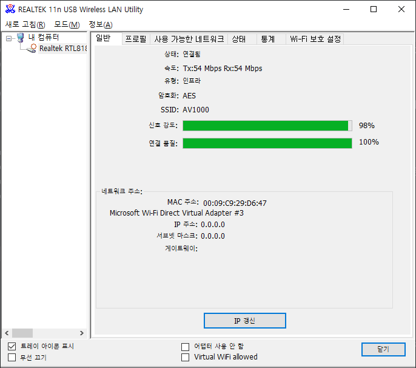

접속 암호는 `12345678`을 입력한다.

정상적으로 연결이 완료되면, 브라우저(크롬)을 실행하고, 주소 입력창에 `192.168.5.1` 또는 `www.av1000.co.kr`을 입력한다.

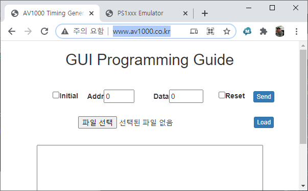

`GUI` 사용 방법은 앞장에서 설명한 내용을 참조하자.

[[TIP]]
보드(`Wemos D1 mini`)의 전원이 OFF되거나 Reset되는 경우에는 PC(Notebook)의 WiFi 접속을 다시 설정해야 한다.

WiFi를 `Station mode`로 사용할 수 있다면, 이럴 필요가 없으며 공유기의 설정에 따라서 PC(Notebook)이 무선(WiFi)를 지원하지 않아도 연결할 수 있다.

이 부분은 공유기 이름(SSID)과 암호(PASSWORD)가 MCU Firmware에 미리 들어있어야 하는데, 제공되지 않았기 때문에 현재는 사용할 수 없다.
[[/TIP]]

## 동작

# => 너무 잘 됨.

## 준비물

Wemos D1 mini( http://auction.kr/iBcUX2T )

USB micro cable( http://auction.kr/iBcb7qB )

TXB0104( http://auction.kr/iBaa9Ik )
